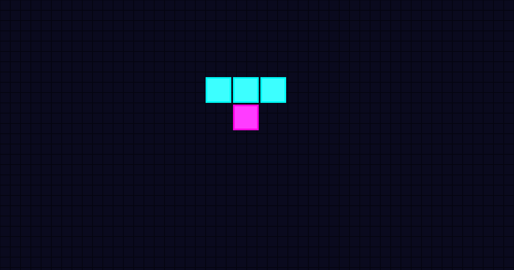

<p align="center">
  
</p>

<h1 align="center">🕹️ Tetris Arcade 🕹️</h1>

<p align="center">
  <strong>A high-fidelity, retro-styled Tetris arcade experience built with modern web technologies.</strong>
</p>

<p align="center">
  <a href="https://dylangrow.github.io/Tetris/"></a>
  <br/>
  <br/>
  
  
  
  
  
</p>

---

## ✨ Features

- **Modern Responsive Layout**: Full-screen arcade cabinet style designed to dynamically adjust to any screen size (desktop, tablet, or mobile).
- **Audio Sound Effects**: Handcrafted retro sound effects using the Web Audio API synthesizer. Complete with a built-in mute control.
- **Vibrant Aesthetics**: High-fidelity dark mode with neon accents, smooth gradients, and satisfying micro-animations (like screen shake on hard drops).
- **Progressive Web App (PWA)**: Installable on your device for offline play, complete with custom pixel-art icons.
- **Classic Mechanics**: True-to-classic speed curves, lock delay (coyote time), and strict hold rules.

## 🎮 Controls

| Action | Keyboard | Touch / Mobile |
| :--- | :--- | :--- |
| **Move Left/Right** | `Left Arrow` / `Right Arrow` | On-screen ⬅️ / ➡️ |
| **Soft Drop** | `Down Arrow` | On-screen ⬇️ |
| **Hard Drop** | `Spacebar` | On-screen ✦ button |
| **Rotate** | `Up Arrow` | On-screen ↻ button |
| **Hold Piece** | `C` or `Shift` | On-screen `HOLD` |
| **Pause/Resume** | `P` or `Esc` | Top right `⏸` button |

*(Mobile controls include haptic vibration feedback on supported devices!)*

## 🚀 Local Development

Want to run the arcade locally or tweak the code?

1. **Clone the repository:**
   ```bash
   git clone https://github.com/DylanGrow/Tetris.git
   cd Tetris
   ```

2. **Install dependencies:**
   ```bash
   npm install
   ```

3. **Start the development server:**
   ```bash
   npm run dev
   ```

4. Open your browser and navigate to the local URL provided by Vite (usually `http://localhost:5173`).

## 🛠️ Build for Production

To create an optimized production build:
```bash
npm run build
```
This generates the bundled files and the PWA service workers in the `dist/` directory.

---

<p align="center">
  <i>Built with ❤️ for the retro gaming community.</i>
</p>
